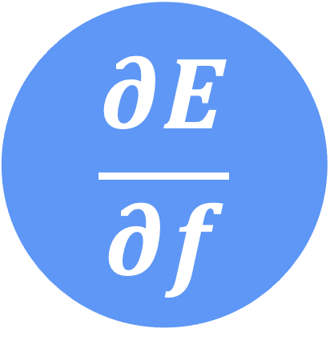
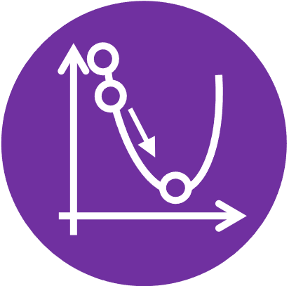
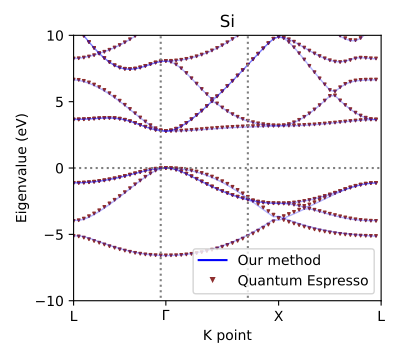
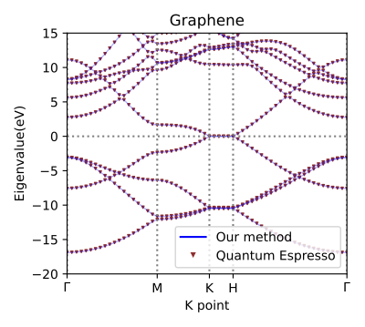
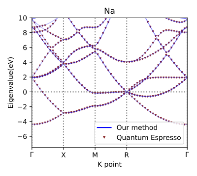
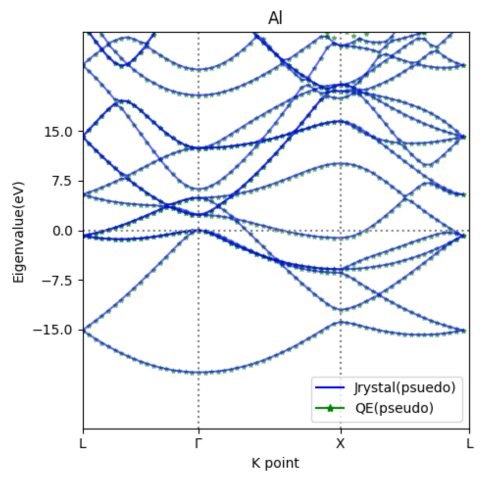

# Jrystal
A JAX-based Differentiable Density Functional Theory Framework for Materials

## Core Features



**Differentiable:** Leveraging JAX's automatic differentiation for efficient gradient computation of quantum properties, enabling straightforward optimization workflows.

<br clear="all"/>


**GPU-Accelerated:** Optimized for modern GPU architectures, delivering high-performance quantum calculations with automatic hardware acceleration.

<br clear="all"/>


**Solid-State Calculation:** Full-featured framework for periodic systems using plane wave basis sets, supporting precise electronic structure calculations of crystalline materials.

<br clear="all"/>



**Direct Optimization:** A direct minimization approach that avoids SCF iterations, enabling smooth convergence and natural integration of machine learning methods, and advanced quantum chemistry methods into density functional theory calculations.

<br clear="all"/>

## Installation

You can install Jrystal directly from GitHub:

```sh
pip install git@github.com:sail-sg/jrystal.git
```

### Development Installation

To install in development mode:

```sh
git clone git@github.com:sail-sg/jrystal.git
cd jrystal
pip install -e .
```

This allows you to modify the source code and have the changes take effect without rebuilding and reinstalling.

To build and serve the documentation locally:
```sh
make doc-dev
```
Then visit `localhost:8000`.

## Usage

Run calculations using the command line interface:

```sh
jrystal -m energy -c config.yaml
```

The following modes are supported:
- `energy`: compute the ground state energy of a system
- `band`: compute the band structure of a system

You can customize the calculation by modifying the `config.yaml` file.

## Band Structure Benchmarks

Jrystal has been benchmarked against Quantum ESPRESSO for various materials. Below are the comparison results for both all-electron and norm-conserving pseudopotential calculations.

### All-electron Calculations



Silicon (Si)

<br clear="all"/>


Aluminum (Al)

<br clear="all"/>



Graphene

<br clear="all"/>



Sodium (Na)

<br clear="all"/>

### Norm-conserving Pseudopotential Calculations


Silicon (Si)

<br clear="all"/>



Aluminum (Al)

<br clear="all"/>

## Development Status

**Note**: The pseudopotential model is currently experimental.

## The Team

This project is jointly developed by [SEA AI LAB (SAIL)](https://sail.sea.com/) and [NUS I-FIM](https://ifim.nus.edu.sg/).

<div align="left">
  
  
</div>

## Citation

If you find this project useful, please cite:

```bibtex
@article{jrystal,
    author = {Li, Tianbo and Shi, Zekun and Zhao, Jiaxi and Dale, Stephen Gregory and Vignale, Giovanni and Neto, AH Castro and Novoselov, Kostya S and Lin, Min},
    title = {Jrystal: A JAX-based Differentiable Density Functional Theory Framework for Materials},
    year = {2025},
    url = {https://github.com/sail-sg/jrystal}
}

@inproceedings{ml4ps2024,
    title = {Jrystal: A JAX-based Differentiable Density Functional Theory Framework for Materials},
    author = {Li, Tianbo and Shi, Zekun and Dale, Stephen Gregory and Vignale, Giovanni and Lin, Min},
    booktitle = {Machine Learning and the Physical Sciences Workshop at NeurIPS 2024},
    year = {2024},
}

@article{li2024diagonalization,
    title={Diagonalization without Diagonalization: A Direct Optimization Approach for Solid-State Density Functional Theory},
    author={Li, Tianbo and Lin, Min and Dale, Stephen and Shi, Zekun and Neto, AH Castro and Novoselov, Kostya S and Vignale, Giovanni},
    journal={arXiv preprint arXiv:2411.05033},
    year={2024}
}
```

## License

This project is licensed under the [Apache License 2.0](https://www.apache.org/licenses/LICENSE-2.0).

## Documentation

For detailed documentation, tutorials, and API reference, please visit our [documentation page](https://jrystal.readthedocs.io/).
