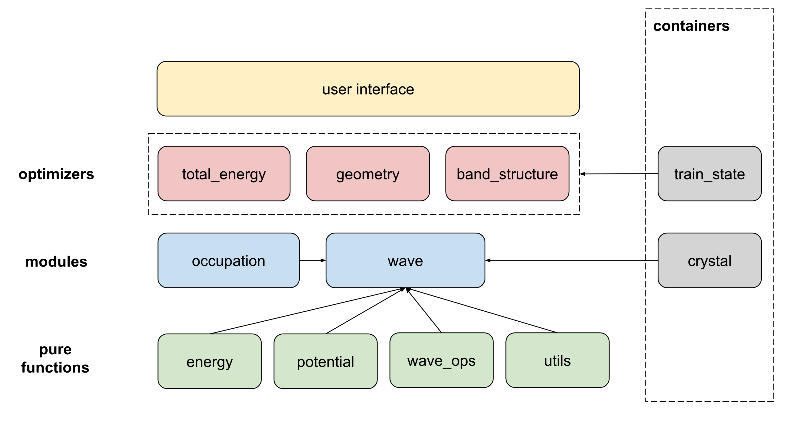

# Jrystal

Plane-wave density functional theory for crystals in JAX

## Getting started

### Why ``jrystal``?

- **Differentiability**. It's fully differentiable!  Easy to get the gradients!
- **GPU acceleration**. It's written in ``JAX``, therefore can be easily run on GPU/TPU devices.
- **Direct optimization**.

### Jrystal design diagram



### Installation
Get source code from github

```sh
git clone git@github.com:sail-sg/jrystal.git
```

```sh
pip install .
```


#### Development mode
```sh
pip install --editable .
```

This allows to modify your source code and have the changes take effect without you having to rebuild and reinstall.

## Examples

#### Total energy minimization
Users may edit the `config` file first and run:
```sh
python jrystal/total_energy.py
```


#### Band structure calculation
Users may run:
```sh
python jrystal/band_structure.py
```


## Developer notes

#### The Jrystal philosophy

- Opt for an ``nn.Module`` object when defining operations:
  - Involve or may involve **trainable parameters**, which necessitate persistent state across different stages of training.
  - Are complex but highly integrated, and can be decoupled from other operations like `black_wave`.

- Opt for a pure function when:
  - the function contains no trainable parameters, and has only a few function arguments or local stateful variables.

- Prefer duplicating code over a bad abstraction.

- A helpful error message is crucial.

- It's better for an abstraction to be small and specific than to be large and general.

- Wave functions are always coupled with its integrals. Thus we recommend to define the integral method within the wave function object.

