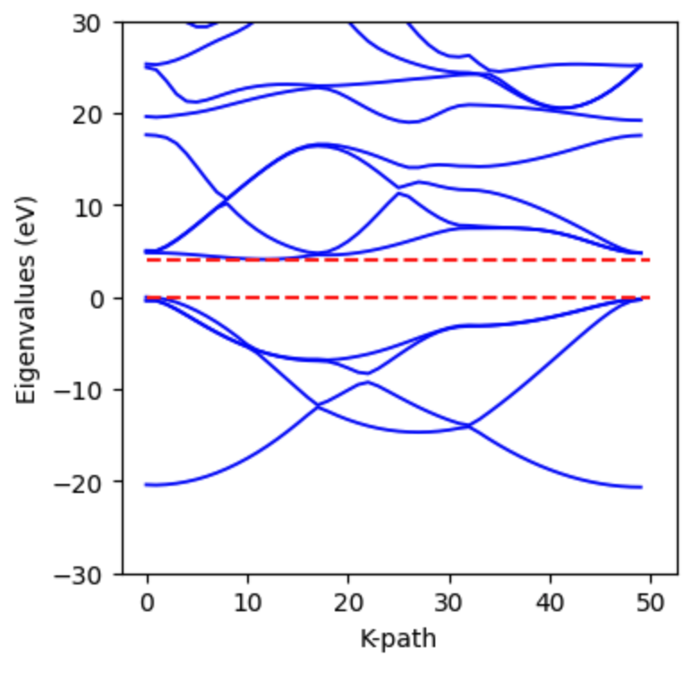

========================================
Band Structure Calculation
========================================

.. note::
  A theoretical derivation of band structure calculations can be found in the tutorial :doc:`/tutorial/band_structure`.

This tutorial demonstrates how to calculate the electronic band structure of a diamond crystal using `jrystal`. Band structure calculations typically involve two steps:

1. Computing the ground state electron density
2. Using this density to solve the Kohn-Sham equations at different k-points

We'll focus primarily on the second step, showing how to calculate the band structure after obtaining the ground state density.

Step 1: Ground State Calculation
------------------------------

First, let's calculate the ground state properties of our diamond crystal.

Import the required packages:

.. code-block:: python
  
  import jax
  import jax.numpy as jnp
  import jrystal as jr

Configure the calculation parameters:

.. code-block:: python
  
  config = jr.config.get_config()  # load default configuration.
  config.crystal = "diamond"  
  # The crystal structure will be loaded from "geometry/diamond.xyz"
  
  config.cutoff_energy = 100   # Approximately 2700 eV
  config.grid_sizes = 48       # 48x48x48 FFT mesh grid
  config.epoch = 10000
  config.k_grid_sizes = 1      # Single K point (Gamma point)
  config.smearing = 0.0001
  config.optimizer_args = {"learning_rate": 1e-3}
  
Calculate the total energy:

.. code-block:: python
  
  total_energy_output = jr.calc.energy(config)
  

Now compute the ground state electron density:

.. code-block:: python
  
  crystal = total_energy_output.crystal
  freq_mask = jr.grid.spherical_mask(
    crystal.cell_vectors, jr.grid.proper_grid_size(config.grid_sizes), config.cutoff_energy
  )
  params_pw = total_energy_output.params_pw
  coeff = jr.pw.coeff(params_pw, freq_mask)
  
  params_occ = total_energy_output.params_occ
  occupation = jr.occupation.idempotent(params_occ, crystal.num_electron, 1)
  density_grid = jr.pw.density_grid(coeff, crystal.vol, occupation)

Step 2: Computing Kohn-Sham Eigenvalues
-------------------------------------

Let's start by calculating the eigenvalues at the Gamma point (k = 0). First, we need to set up our calculation grid:

.. code-block:: python
  
  g_vecs = jr.grid.g_vectors(crystal.cell_vectors, jr.grid.proper_grid_size(config.grid_sizes))
  kpts = jr.grid.k_vectors(crystal.cell_vectors, jr.grid.proper_grid_size(config.k_grid_sizes))

Now we can compute the Kohn-Sham Hamiltonian matrix:

.. code-block:: python
  
  hamil_matrix = jr.hamiltonian.hamiltonian_matrix(
    coeff, crystal.positions, crystal.charges, density_grid, g_vecs, kpts, crystal.vol, kohn_sham=True
  )
  

The resulting Hamiltonian matrix has an interesting structure:

.. image:: images/band_gamma.png
   :width: 400
   :align: center

.. Note:: 
  
  According to our research paper `Li2024`_, the Hamiltonian matrix self-diagonalizes during free energy minimization. However, you might notice this matrix isn't fully diagonal. This occurs because of electron occupation degeneracy in the core regions (occupation = 1) and high-energy bands (occupation = 0).

Let's examine the occupation numbers:

.. code-block:: python
  
  print(jnp.sort(jnp.round(occupation, 2)))
  
  >>> [0.  , 0.  , 0.  , 0.  , 0.  , 0.  , 0.07, 0.09, 1.89, 1.96, 1.99, 2.  , 2.  , 2.  ]

.. Note:: 
  
  The value of 2 appears because in spin-restricted calculations, each band can hold two electrons with opposite spins.

To get the Kohn-Sham eigenvalues, we simply need to diagonalize the Hamiltonian matrix:

.. code-block:: python
  
  evals_gamma = jnp.linalg.eigvalsh(hamil_matrix[0])
  print(evals_gamma)
  
  >>> [-7.67813799, -7.65829657, -0.13900975,  0.60935214,  0.61061926,
        0.61237885,  0.79693345,  0.80341756,  2.39194797,  4.57702582,
        7.81532253, 17.31096626, 19.20340566, 56.55011329]

We can calculate the band gap at the Gamma point:

.. code-block:: python
  
  band_gap = (evals_gamma[6] - evals_gamma[5]) * jr._src.const.HARTREE2EV
  print(f"The band gap at Gamma point is {band_gap:.4f} eV.") 
  
  >>> The band gap at Gamma point is 5.0220 eV.

Step 3: Band Structure Along a K-path
----------------------------------

To compute the full band structure, we need to calculate eigenvalues along a path through the Brillouin zone. This presents a challenge: we don't have converged coefficients for k-points that weren't in our original k-mesh.

We solve this using two strategies:
1. For each new k-point, we minimize the Hamiltonian matrix trace using the ground state density
2. We use the parameters from the previous k-point as initial values for the next point, improving convergence efficiency

Let's implement this approach:

First, generate a k-path through high-symmetry points (Γ → X → L → Γ):

.. code-block:: python
  
  k_path = jr._src.band.get_k_path(crystal.cell_vectors, path="GXLG", num=50)
  print(k_path[0:4])
  
  >>> [[ 0.00000000e+00  0.00000000e+00  0.00000000e+00]
  [-5.89079908e-18  5.48359699e-02  1.28296930e-17]
  [-1.17815982e-17  1.09671940e-01  2.56593860e-17]
  [-3.26677455e-17  1.64507910e-01  3.26677455e-17]]
  
Now let's set up our optimization for the first k-point (Γ). We'll define a trace function:

.. code-block:: python

  def hamil_trace(params):
    coeff = jr.pw.coeff(params, freq_mask)
    return jr.hamiltonian.hamiltonian_matrix_trace(
        coeff, crystal.positions, crystal.charges, density_grid, 
        g_vecs, k_path[0:1], crystal.vol, kohn_sham=True
    )

Set up the optimizer and create the optimization loop:

.. code-block:: python
  
  import optax

  optimizer = optax.adam(learning_rate=1e-3)
  opt_state = optimizer.init(params)

  for i in range(1000):
    grad = jax.grad(hamil_trace)(params)
    updates, opt_state = optimizer.update(grad, opt_state)
    params = optax.apply_updates(params, updates)
  
    params_pw = total_energy_output.params_pw

  # Define update step (JIT-compiled for speed)
  @jax.jit
  def update(params_pw, opt_state):
          e_tot, grads = jax.value_and_grad(hamil_trace)(params_pw)
          updates, opt_state = optimizer.update(grads, opt_state)
          params_pw = optax.apply_updates(params_pw, updates)
          return e_tot, params_pw, opt_state

  # Run optimization
  print("Starting optimization...")
  for i in range(10000):
      e_tot, params_pw, opt_state = update(params_pw, opt_state)

      if (i+1) % 100 == 0:
          print(f"Step {i+1:4d} | Hamiltonian Trace: {e_tot:.4f} Ha")

After optimization, compute the eigenvalues at the first k-point:

.. code-block:: python
  
  coeff= jr.pw.coeff(params_pw, freq_mask)
  hamil_matrix = jr.hamiltonian.hamiltonian_matrix(
    coeff, crystal.positions, crystal.charges, density_grid, g_vecs, k_path[0:1], crystal.vol, kohn_sham=True
  ) 

  evals_0 = jnp.linalg.eigvalsh(hamil_matrix[0])
  print(evals_0)

  >>> [-7.67815119, -7.65829707, -0.13902394,  0.60937034,  0.61061365,
        0.61238018,  0.79523348,  0.79585523,  0.79619886,  1.26561079,
        1.32554965,  1.54347084,  1.54436551,  1.5456989 ]
        
Let's compare these eigenvalues with our earlier total energy calculation:

.. code-block:: python
  
  print(total_energy_output.evals_gamma)

  >>> [-7.67813799, -7.65829657, -0.13900975,  0.60935214,  0.61061926,
        0.61237885,  0.79693345,  0.80341756,  2.39194797,  4.57702582,
        7.81532253, 17.31096626, 19.20340566, 56.55011329]
        
Notice that the lower eigenvalues match well, while higher energy values differ. This occurs because during the total energy calculation, high-energy bands quickly converge to zero occupation, stopping their coefficient updates.

Step 4: Computing the Full Band Structure
--------------------------------------

Now we'll calculate eigenvalues for all k-points along our path. First, define a helper function:

.. code-block:: python
  
  def get_evals(k_idx, params_pw):
    def hamil_trace(params):
        coeff = jr.pw.coeff(params, freq_mask)
        return jr.hamiltonian.hamiltonian_matrix_trace(
            coeff, crystal.positions, crystal.charges, density_grid, 
            g_vecs, k_path[k_idx:(k_idx+1)], crystal.vol, kohn_sham=True
        )
    opt_state = optimizer.init(params_pw)
    coeff = jr.pw.coeff(params_pw, freq_mask)
    @jax.jit
    def update(params_pw, opt_state):
            e_tot, grads = jax.value_and_grad(hamil_trace)(params_pw)
            updates, opt_state = optimizer.update(grads, opt_state)
            params_pw = optax.apply_updates(params_pw, updates)
            return e_tot, params_pw, opt_state

    # Run optimization
    for i in range(500):
        e_tot, params_pw, opt_state = update(params_pw, opt_state)
    
    coeff= jr.pw.coeff(params_pw, freq_mask)
    hamil_matrix = jr.hamiltonian.hamiltonian_matrix(
        coeff, crystal.positions, crystal.charges, density_grid, g_vecs, k_path[k_idx:(k_idx+1)], crystal.vol, kohn_sham=True
    )

    evals = jnp.linalg.eigvalsh(hamil_matrix[0])
    return evals, params_pw

Calculate eigenvalues for all k-points:

.. code-block:: python
  
  evals_list = []
  for k_idx in range(len(k_path)):
    evals, params_pw = get_evals(k_idx, params_pw)
    evals_list.append(evals)

  band_structure = jnp.stack(evals_list)*jr._src.const.HARTREE2EV

The resulting band structure shows a clear band gap:

References
^^^^^^^^^^

.. [Li2024] Li, Tianbo, et al. "Diagonalization without Diagonalization: A Direct Optimization Approach for Solid-State Density Functional Theory." arXiv preprint arXiv:2411.05033 (2024).
