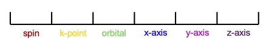

.. _tutorial-array-shape:

Understanding Variable Shapes in ``jrystal``
==========================================

Variable shapes in ``jrystal`` follow specific conventions that define both the structure of API arguments and the meaning of each axis. Understanding these shapes is crucial for effective use of the library.

Standard Axis Convention
----------------------

The typical ordering of axes in ``jrystal`` follows this convention:

This convention applies to many variables including ``wave_grid``, ``density_grid``, and ``coefficient``. Here's what each axis represents:

- **Spin axis**: Dimension can be either 1 (spin-restricted calculations) or 2 (spin-unrestricted calculations)
- **k-point axis**: Dimension equals the number of k-points in the calculation
- **Orbital (Band) axis**: Dimension corresponds to the number of orbitals
- **Spatial axes (x, y, z)**: Dimensions represent the number of grid points in real or reciprocal space

Design Philosophy
---------------

The axis ordering is designed with performance in mind. Axes that can be processed in parallel are positioned at the beginning of the array shape. This strategic ordering offers two key advantages:

1. Enables efficient parallel computations across multiple dimensions
2. Optimizes JAX's vectorization capabilities through ``jax.vmap`` and ``jax.pmap``

Special Cases
-----------

Not all variables use all six axes. For example, ``g_vector_grid`` only uses the spatial axes (x, y, z) plus an additional coordinate axis, resulting in a shape of ``(x, y, z, 3)``.

