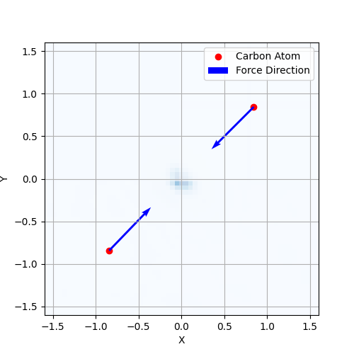

.. _tutorial-differentiation:

What Can Differentiability Do for Density Functional Theory
=======================================================

So what can Automatic Differentiation (AD) do for Density Functional Theory? The short answer is that AD can greatly simplify the calculation of all gradients. Researchers don't have to manually derive all the gradients or Hessian matrices and implement them on their own -- you can just write down the function that you would like to differentiate, and AD will do the rest.

Next, we will show two examples to demonstrate how AD can help us calculate the Kohn-Sham Hamiltonian matrix and the Ewald energy.

Example: Kohn-Sham Hamiltonian matrix
-------------------------------------

Once we have a ground-state density :math:`\rho(\mathbf{r})`, the Kohn-Sham Hamiltonian matrix is defined as 

.. math::

  H_{ij} = < \psi_i | \hat{H}[\rho] | \psi_j >

where :math:`\psi_i` is the Kohn-Sham orbital. Although the analytical form of such a matrix is available, we don't have to implement it on our own, which could be quite time-consuming. As long as we have the total energy functional, we can use AD to calculate the Hamiltonian matrix, as we know that it is simply the Hessian of the total energy functional with respect to the orbital coefficients. 

Let :math:`\mathbf{u}` be a coefficient vector of the Kohn-Sham orbitals, and a linear combination of the orbitals can be written as:

.. math::

  \chi = \sum_i u_i \psi_i

The expectation of the Hamiltonian with respect to the linear combination is:

.. math::
  
  E = < \chi | \hat{H}[\rho] | \chi > = \sum_{ij} u_i^* u_j < \psi_i | \hat{H}[\rho] | \psi_j > = \mathbf{u}^\dagger H \mathbf{u}

Therefore, we can obtain the Hamiltonian matrix :math:`H` by calculating the Hessian of the total energy functional with respect to the orbital coefficients :math:`\mathbf{u}`. 

.. math::
  
  \dfrac12 \nabla_{\mathbf{u}}^2 E = H

Well, it is not as simple as it looks. The above energy function, which is a complex-valued function, is not a **holomorphic function** with respect to the orbital coefficients. Currently, JAX does not support the API of Hessian for complex-valued non-holomorphic functions. Therefore, we need to implement a complex-Hessian function using the ``jax.vjp`` function.
This implementation is now available in the ``jrystal.hessian.complex_hessian`` function.

If you understand the above derivation, you can understand how we implement the ``jrystal.hamiltonian.hamiltonian_matrix`` function.

.. code-block:: python
  
  def hamiltonian_matrix(
    coeff,
    positions,
    charges,
    effictive_density_grid,
    g_vector_grid,
    k,
    vol,
    xc
  ):

    num_bands = coeff.shape[2]

    def efun(u):
      _coeff = jnp.einsum("i, *n i a b c -> *n a b c", u, coeff)
      _coeff = jnp.expand_dims(_coeff, axis=-4)

      energy = hamiltonian_matrix_trace(
        _coeff,
        positions,
        charges,
        effictive_density_grid,
        g_vector_grid,
        k,
        vol,
        xc,
        kohn_sham,
      )

      return 0.5 * jnp.sum(energy)

    x = jnp.ones(num_bands, dtype=band_coefficient.dtype)
    return complex_hessian(efun, x)

Example: DFT forces
-------------------

The DFT force acting on an ion A is defined as:

.. math::

  F_A = - \nabla_A E_{\text{tot}}[\rho](A)
  
where :math:`A` is the position of the ion.

In ``jrystal``, we can calculate the force using the ``jax.grad`` function. 

Initialize the system and prepare the mesh grids and other parameters.

.. code-block:: python

  import jax
  import jax.numpy as jnp
  import jrystal as jr
  from jrystal import energy

  key = jax.random.PRNGKey(123)
  charges = jnp.array([6, 6])  # two carbon atoms
  positions = jnp.array([[-0.8425, -0.8425, -0.8425], [0.8425, 0.8425, 0.8425]]) 
  cell_vectors = jnp.array([[0., 3.37, 3.37], [3.37, 0., 3.37], [3.37, 3.37, 0.]])
  
  crystal = jr.Crystal(chages=charges, positions=positions, cell_vectors=cell_vectors)

  # Set grid parameters
  grid_size = [64, 64, 64]  # Real and reciprocal space grid
  kpt_grid = [1, 1, 1]      # Gamma point

  g_vecs = jr.grid.g_vectors(crystal.cell_vectors, grid_sizes=grid_size)
  kpts = jr.grid.k_vectors(crystal.cell_vectors, grid_sizes=kpt_grid)
  
  freq_mask = jr.grid.spherical_mask(
      cell_vectors=crystal.cell_vectors,
      grid_sizes=grid_size,
      cutoff_energy=100
  )

  # Set the occupation
  occ = jr.occupation.uniform(num_kpts, crystal.num_electron, num_bands=num_bands)
  density = jr.pw.density_grid(coeff, crystal.vol, occ)

We can define a energy function of the positions of the ions. using the ``jrystal.energy.total_energy`` function.

.. code-block:: python
  
  def energy(position):
    e_tot = jr.energy.total_energy(coeff, position, crystal.charges, g_vecs, kpts, crystal.vol, occ)
    e_nuc = jr.energy.nuclear_repulsion(position, crystal.charges, crystal.cell_vectors, g_vecs, crystal.vol, 0.1, 5000)
    return (e_tot + e_nuc)

The forces of the ions are the negative gradient of the energy function with respect to the positions of the ions.

.. code-block:: python
  
  forces = -jax.grad(energy)(positions)
  print(forces)

  >>> [[ 2.4587612  2.4767363  2.3396077]
 [-2.4314194 -2.5411198 -2.3505976]]

The next figure shows the forces calculated by ``jrystal`` on a diamond crystal with almost uniformly distributed electron density. The forces are calculated using ``jax.grad`` and ``jrystal``.

