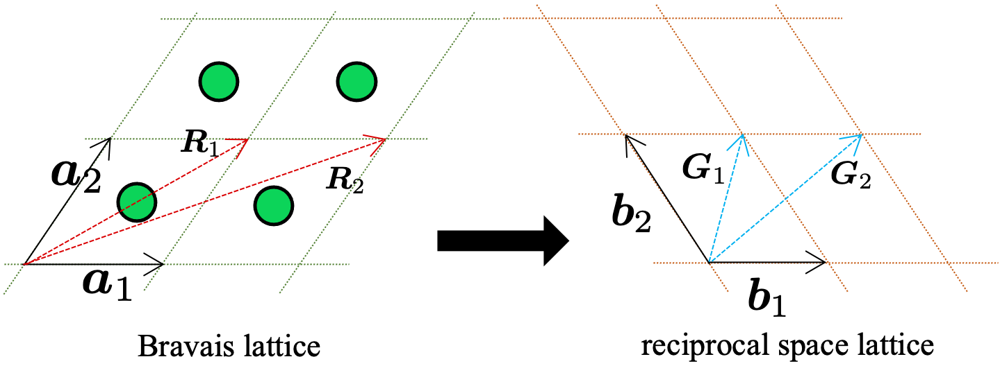

An Introduction to Crystallography
==================================

Crystallography is the study of how atoms, ions, or molecules are arranged in solids. This field forms the basis for understanding material properties and is integral to disciplines such as materials science, solid-state physics, and even computer science—especially when it comes to simulating or designing new materials. This guide introduces the essential concepts of crystallography in clear, accessible language for those who may be new to material science.

Crystal Structure
^^^^^^^^^^^^^^^^^

At the heart of crystallography is the crystal structure: the orderly, repeating arrangement of the building blocks (atoms, ions, or molecules) within a solid. This ordered structure results in translational symmetry, meaning that the pattern repeats itself at regular intervals throughout the material. For instance, metals like copper and aluminum typically adopt a face-centered cubic (FCC) structure, whereas iron and tungsten often form a body-centered cubic (BCC) lattice. These different arrangements affect properties such as strength, conductivity, and melting point.

.. image:: images/bccfcc.png
    :width: 50%
    :align: center

Bravais Lattices
^^^^^^^^^^^^^^^^^
To simplify the study of these repeating patterns, crystallographers use the concept of the Bravais lattice. In three-dimensional space, the positions of lattice points—which represent the repeating units of the crystal—are generated by three basic vectors, :math:`\boldsymbol{a}_1`, :math:`\boldsymbol{a}_2`, and :math:`\boldsymbol{a}_3`. Mathematically, any lattice point is described by:

.. math::

  \boldsymbol{R}_{\boldsymbol{m}} = m_1 \boldsymbol{a}_1 + m_2 \boldsymbol{a}_2 + m_3 \boldsymbol{a}_3,

where :math:`m_1`, :math:`m_2`, :math:`m_3` are integers. This formulation allows us to focus on a single repeating unit—the unit cell—rather than the entire, complex assembly of atoms.

Reciprocal space
^^^^^^^^^^^^^^^^^
In addition to describing a crystal in real space, it is often useful to study its properties in reciprocal space. This alternate viewpoint maps the periodicity of the crystal into a space of spatial frequencies. In reciprocal space, each vector corresponds to a wavevector of plane waves—these could represent electrons, X-rays, or other probing waves interacting with the crystal. The mathematical relationship between the real-space lattice and its reciprocal counterpart is key to understanding diffraction patterns, a fundamental tool in crystallography.

The reciprocal lattice vectors, :math:`\boldsymbol{b}_1`, :math:`\boldsymbol{b}_2`, and :math:`\boldsymbol{b}_3`, are defined as:

.. math::

  \begin{align}
    \boldsymbol{b}_1 &= 2\pi \dfrac{ \boldsymbol{a}_2 \times \boldsymbol{a}_3 }{ \Vert \Omega\Vert }, \\
    \boldsymbol{b}_2 &= 2\pi \dfrac{ \boldsymbol{a}_1 \times \boldsymbol{a}_3 }{ \Vert \Omega \Vert }, \\
    \boldsymbol{b}_3 &= 2\pi \dfrac{ \boldsymbol{a}_1 \times \boldsymbol{a}_2 }{ \Vert \Omega \Vert }, 
  \end{align}

with the unit cell volume given by :math:`\Vert \Omega \Vert = \big\Vert (\boldsymbol{a}_1 \times \boldsymbol{a}_2) \cdot \boldsymbol{a}_3 \big\Vert`. The reciprocal vectors satisfy the condition:

.. math::

  \boldsymbol{b}_i \cdot \boldsymbol{a}j = 2\pi \delta{ij},

where :math:`\delta_{ij}` is the Kronecker delta.

  
Brillouin zone and k-path sampling
^^^^^^^^^^^^^^^^^^^^^^^^^^^^^^^^^^^^

The Brillouin zone is the *Wigner-Seitz primitive cell* in the reciprocal lattice of a crystalline material. It defines the range of wave vectors in a crystal's reciprocal space that provide a comprehensive representation of its electronic properties. The periodic nature of a crystal lattice leads to a periodicity in the reciprocal space as well. As a result of this periodicity, the electronic properties of a crystal within any Brillouin zone are equivalent to those in the first Brillouin zone. Thus, by focusing solely on the first Brillouin zone, one can comprehensively understand and describe the electronic properties of the crystal.

The term :math:`\boldsymbol{k}`-points references specific locations within the Brillouin zone in the reciprocal space. Given that electron behavior in a periodic crystal spans the entire Brillouin zone, there's a requisite to sample this space to encompass all potential electron momenta. However, the combination of periodicity and symmetry negates the need to assess properties at every position within the zone. Instead, a valid chosen subset of :math:`\boldsymbol{k}`-points provides an efficient sampling mechanism.

.. image:: images/kpath.png
    :width: 50%
    :align: center

Bloch's theorem
^^^^^^^^^^^^^^^^^^^^^^^^^^^^^^^^^^^^

.. role:: red
  
    :class: red
    
.. raw:: html

    

Bloch's theorem is a fundamental result in solid-state physics that describes the
behaviors of the electronic wavefunction in periodic potential: the electronic wavefunction
:math:`\psi` in a periodic potential is a Bloch state, meaning that it can be written in the form:

.. math::

  \psi(\mathbf{r}) = e^{i\mathbf{k}\cdot \mathbf{r}}u(\mathbf{r})

where :math:`u(\mathbf{r})` has the same periodicity as the atomic structure of the crystal, i.e.
:math:`u(\mathbf{r + a}) = u(\mathbf{r})`, where :math:`\mathbf{a}` is any lattice vector of the crystal.
:math:`\mathbf{k}` is unique in the first Brillouin zone.
Bloch's theorem emphasizes the importance of the periodicity of the crystal structure as well as the
k-points in the Brillouin zone.

We provide a brief proof of Bloch's theorem below:

Define the translation operator :math:`\hat{\mathbf{T}}_\mathbf{n}` acting on the wavefunctions as:

.. math::

  \hat{\mathbf{T}}_n\psi(\mathbf{r}) = \psi(\mathbf{r} + \mathbf{n}) 

In crystalline system, as the externel potential is periodic, the
Hamiltonian commutes with the translation operator, i.e.

.. math::

  [\hat{\text{H}}, \hat{\mathbf{T}}_\mathbf{n}] := \hat{\text{H}}\hat{\mathbf{T}}_\mathbf{n}
  - \hat{\mathbf{T}}_\mathbf{n}\hat{\text{H}} = 0, \quad \forall \ \mathbf{n} \text{ is a lattice vector}

Moreover, translation operators with different translation vectors :math:`\mathbf{n}_i` trivially commute.
By linear algebra theory, all these operators share the same set of eigenvector. Moreover, the normalization
condition of the wavefunction requires that

.. math::

  |\lambda_n|^2\int_{\Omega}\psi^*(\mathbf{r})\psi(\mathbf{r})d\mathbf{r} = \int_{\Omega}(\hat{\mathbf{T}}_\mathbf{n}\psi)^*(\mathbf{r})\hat{\mathbf{T}}_\mathbf{n}\psi(\mathbf{r})d\mathbf{r} 
  = \int_{\Omega}\psi^*(\mathbf{r})\psi(\mathbf{r})d\mathbf{r} = 1

Therefore, the eigenvalues :math:`\lambda_{\mathbf{n}}` has unit module. All eigen-wavefunctions have the
following form:

.. math::

  \psi(\mathbf{r} + \mathbf{n}) = \hat{\mathbf{T}}_n\psi(\mathbf{r}) 
  = e^{-i\mathbf{k}\cdot \mathbf{n}}\psi(\mathbf{r}), \quad \forall \ \mathbf{n} \text{ is a lattice vector}

Therefore, define :math:`u(\mathbf{r}) = e^{i\mathbf{k}\cdot \mathbf{r}}\psi(\mathbf{r})`, one has

.. math:: 

  u(\mathbf{r} + \mathbf{n}) = e^{i\mathbf{k}\cdot (\mathbf{r} + \mathbf{n})}\psi(\mathbf{r} + \mathbf{a}) 
  = e^{i\mathbf{k}\cdot \mathbf{r}}\psi(\mathbf{r}) = u(\mathbf{r}), \quad \forall \ \mathbf{n} \text{ is a lattice vector}

which is the periodic function stated in the Bloch's theorem.
