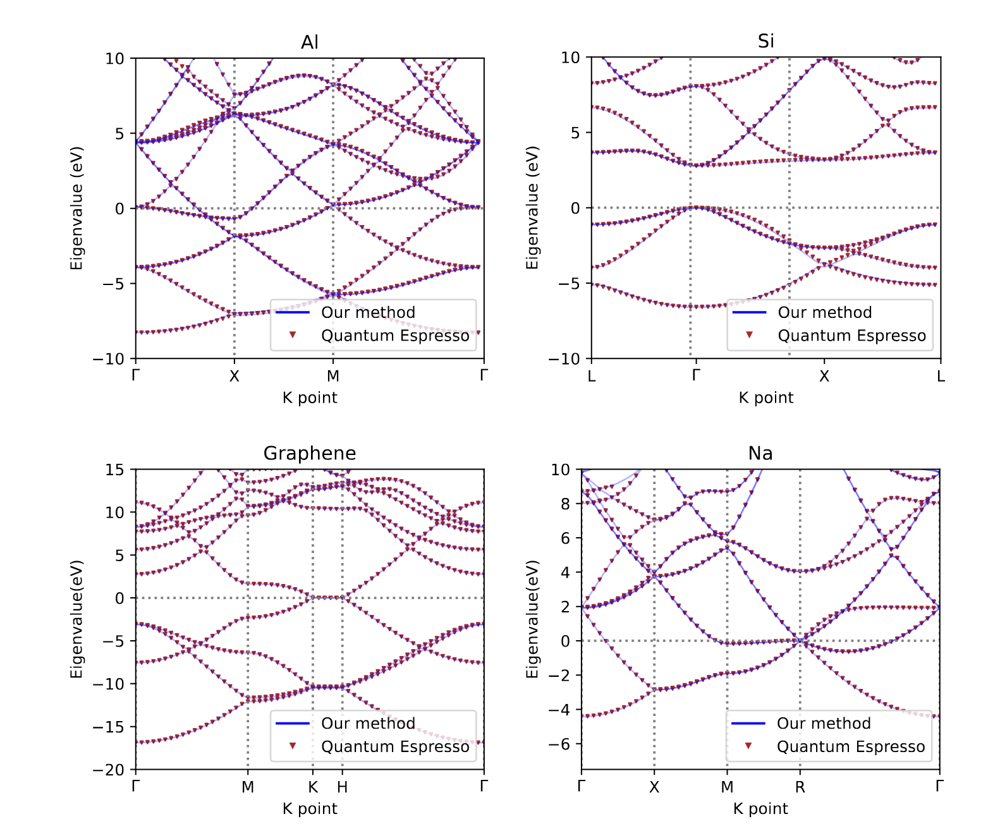

.. _occupation:

How Do We Deal with Occupation Numbers in Direct Optimization?
=============================================================

As a differentiable DFT code, ``jrystal`` employs direct energy minimization to compute electronic ground states. A key challenge for solids is efficiently incorporating occupation numbers into this framework, as their optimization requires careful treatment of partial orbital occupancy near the Fermi level. To address this, ``jrystal`` introduces an entropy functional into the total energy, transforming it into a free energy.

The figure above compares ``jrystal``'s results (direct minimization with Fermi-Dirac smearing, 3x3x3 k-mesh) to Quantum ESPRESSO. The close agreement demonstrates the equivalence of our approach to established DFT methodologies.

.. note::
  This tutorial is adaptived from our preprint paper [Li2024]_.

Theory
------

Free Energy Minimization
^^^^^^^^^^^^^^^^^^^^^^^^

The starting point of our approach is the [hohenberg1964density]_ density functional theory (DFT) as generalized by [mermin1965thermal]_ to thermal ensembles.  According to this
the equilibrium density of the many-electron system is obtained by minimizing the free energy :math:`A[n]`, regarded as a functional of the electronic density :math:`n(\boldsymbol{r})`.

.. math::
  A[n]=T_s[n]+E_{Hxc}[n]+\int V_{ext}(\boldsymbol{r})n(\boldsymbol{r})d\boldsymbol{r} - T S[n]

where :math:`T_s[n]` is the kinetic energy functional, :math:`E_{Hxc}[n]` is the Hartree and exchange-correlation energy functional, :math:`V_{ext}(\boldsymbol{r})` is the external potential, and :math:`S[n]` is the entropy functional, and :math:`T` is the temperature.

The density :math:`n(\boldsymbol{r})` is a function with respect to both occupation matrix and single-particle wave function, which takes the form

.. math::
  n(\boldsymbol{r})=\sum_{ij, \boldsymbol{k}} \gamma_{ij}( \boldsymbol{k})\psi^*_j(\boldsymbol{k}, \boldsymbol{r})\psi_i(\boldsymbol{k}, \boldsymbol{r})

where :math:`\gamma_{ij}(\boldsymbol{k})` is the occupation number of the single-particle wave function :math:`\psi_i(\boldsymbol{k},\boldsymbol{r})`.

In this equation, the  sum runs over :math:`\boldsymbol{k}` in the first Brillouin zone, and

.. math::
	\int \psi^*_j(\boldsymbol{k}, \boldsymbol{r})  \psi_i(\boldsymbol{k}',\boldsymbol{r}) d\boldsymbol{r} = \delta_{\boldsymbol{k},\boldsymbol{k}'}\delta_{ij}

The occupation matrix :math:`\hat\gamma` must have the following properties: 

- Hermiticity. The occupation matrix :math:`\hat\gamma` must be Hermitian, meaning it satisfies 

  .. math::
    \gamma_{ij}(\boldsymbol{k})=\gamma_{ji}^*(\boldsymbol{k})
- Pauli exclusion principle. The occupation matrix :math:`\hat\gamma` must be a positive semi-definite matrix, meaning the eigenvalues, denoted as :math:`\{f_{i, \boldsymbol{k}}\}`, are comprised between 0 and 1.

  .. math::
    0 \leq f_{i, \boldsymbol{k}} \leq 1

- Charge Conservation. The occupation matrix :math:`\hat\gamma` must satisfy the charge conservation, meaning the trace of the occupation matrix is equal to the number of electrons.

  .. math::
	  \sum_{\boldsymbol{k}}{\rm Tr}\{\hat \gamma(\boldsymbol{k})\}=\sum_{i,\boldsymbol{k}}\gamma_{ii}(\boldsymbol{k})=NK.

Unitary Invariance
^^^^^^^^^^^^^^^^^^
With the occupation matrix :math:`\hat\gamma`, the free energy can be represented as a functional of :math:`\hat\gamma` and :math:`\{\psi\}` as follows:

.. math::
  A[\hat\gamma,\{\psi\}]=E[\hat\gamma,\{\psi\}] - TS[\hat\gamma].

:math:`S[\hat\gamma]` is the entropy of a noninteracting system of fermions with occupation matrix :math:`\hat \gamma`, i.e.,

.. math::
   S[\hat\gamma] = -\sum_{\boldsymbol{k}}{\text{Tr}} \left\{ \hat\gamma(\boldsymbol{k}) \ln \hat\gamma(\boldsymbol{k}) +\Big[\hat1-\hat\gamma(\boldsymbol{k})\Big]\ln \Big[ \hat1-\hat\gamma(\boldsymbol{k}) \Big] \right\}

This function is invariant with respect to a unitary transformation of the potentially occupied orbital among themselves, combined with the corresponding transformation of the occupation matrix, i.e., the transformation

.. math::
  \psi_i(\boldsymbol{k},\boldsymbol{r}) \to \sum_j U_{ij}(\boldsymbol{k}) \psi_j(\boldsymbol{k},\boldsymbol{r})\,,~~~~\gamma_{ij}(\boldsymbol{k}) \to  \sum_{i'j'}U_{ii'}(\boldsymbol{k})\gamma_{i'j'}(\boldsymbol{k}) U^\dagger_{j'j}(\boldsymbol{k})\,,
  
leaves the density, the energy, and in general all the physical properties of the system unchanged. This implies that the solution of the minimization problem cannot be unique, since we can always apply a unitary transformation that does not change the physical properties. 

Stationary Condition
^^^^^^^^^^^^^^^^^^^^^

To minimize the free energy :math:`A` under the orthonormality constraint on :math:`\{ \psi \}` and the trace constraint of :math:`\hat\gamma`, one typically employs the Lagrange multiplier method. The Lagrangian can be written as

.. math::
    \mathcal{L} = A[\hat\gamma,\{\psi\}] - \sum_{ij, \boldsymbol{k}} \lambda_{ij}(\boldsymbol{k}) \left( \int \psi^*_j(\boldsymbol{k},\boldsymbol{r})  \psi_i(\boldsymbol{k},\boldsymbol{r}) d\boldsymbol{r} - \delta_{ij} \right) - \mu \left(\sum_{\boldsymbol{k}}{\rm Tr}\{\hat \gamma(\boldsymbol{k})\} - NK\right)

where :math:`\lambda_{ij}(\boldsymbol{k})` is a Hermitian matrix of Lagrange multipliers (collectively denoted by :math:`\hat\lambda(\boldsymbol{k})`) that enforces the orthonormality constraint at each :math:`\boldsymbol{k}`, and :math:`\mu` is the Lagrange multiplier for the trace constraint, commonly referred to as the chemical potential. At the stationary point of :math:`A`, the system must satisfy the following conditions with respect to both the occupation matrix :math:`\hat \gamma` and eigenfunctions :math:`\{\psi\}`:

.. math::
    \dfrac{\delta  \mathcal{L}}{\delta \psi_i^*(\boldsymbol{r})} = 0, \quad\quad  \dfrac{\delta  \mathcal{L}}{\delta \gamma_{ji}(\boldsymbol{r})} = 0.

Stationary Condition for :math:`\psi`
""""""""""""""""""""""""""""""""""""

Requiring that :math:`A` is stationary with respect to infinitesimal variation of :math:`\psi_i^*(\boldsymbol{r})`, i.e. :math:`\frac{\delta \mathcal{L}}{\delta \psi_i^*(\boldsymbol{r})} = 0`, yields the equation

.. math::
    \sum_j \gamma_{ij}(\boldsymbol{k}) \hat H_s\psi_j(\boldsymbol{k},\boldsymbol{r}) =  \sum_j \lambda_{ij}(\boldsymbol{k})  \psi_j(\boldsymbol{k},\boldsymbol{r})\,,

If :math:`\hat \gamma` is invertible, which holds at finite temperature, we can define:

.. math::
    \hat h(\boldsymbol{k}) = ({\hat\gamma(\boldsymbol{k})})^{-1} \hat\lambda(\boldsymbol{k})\,,

with :math:`h_{ij}(\boldsymbol{k})` represents the matrix element at a given :math:`\boldsymbol{k}`. With this substitution, the equation simplifies to:

.. math::
    \hat H_s\psi_i(\boldsymbol{k},\boldsymbol{r}) =  \sum_j h_{ij}(\boldsymbol{k})  \psi_j(\boldsymbol{k},\boldsymbol{r})\,,

At the equilibrium the matrix elements :math:`h_{ij}(\boldsymbol{k})` are expressed as:

.. math::
    h_{ij}(\boldsymbol{k}) = \int \psi^*_j(\boldsymbol{k},\boldsymbol{r}) H_s\psi_i(\boldsymbol{k},\boldsymbol{r}) d\boldsymbol{r}

which is commonly referred to as the *Kohn-Sham Hamiltonian matrix*.
Furthermore, :math:`\hat{h}(\boldsymbol{k})` can be brought to diagonal form by a unitary transformation, such that :math:`h_{ij}(\boldsymbol{k})\to \varepsilon_i(\boldsymbol{k}) \delta_{ij}`. In this case, this stationary condition reduces to the Kohn-Sham Equation:

.. math::
    \hat H_s\psi_i(\boldsymbol{k},\boldsymbol{r}) =  \varepsilon_{i}(\boldsymbol{k})  \psi_i(\boldsymbol{k},\boldsymbol{r})\,,

This establishes the fact that the set of optimal orbitals :math:`\{\psi\}` is *unitarily equivalent* to the set of eigenfunctions of the Kohn-Sham Hamiltonian, with eigenvalues :math:`\varepsilon_i(\boldsymbol{k})`. In other words, there always exists a unitary transformation that can convert the optimal :math:`\{ \psi \}` that extremize :math:`A` into the solutions of the Kohn-Sham equation.

Stationary Condition for :math:`\gamma`
""""""""""""""""""""""""""""""""""""""

Requiring that :math:`A` is stationary with respect to infinitesimal variation of :math:`\gamma_{ij}(\boldsymbol{k})`, i.e., :math:`\frac{\delta  \mathcal{L}}{\delta \gamma_{ji}(\boldsymbol{r})} = 0`, yields the equation:

.. math::
    T\frac{\delta S[\hat \gamma]}{\delta\gamma_{ji}(\boldsymbol{k}) }=\frac{\delta E[\hat \gamma]}{\delta\gamma_{ji}(\boldsymbol{k})}-\mu\delta_{ij}\,,

where :math:`\mu` (chemical potential) is the Lagrange multiplier that enforces the trace constraint.
It is not difficult to show that

.. math::
    \frac{\delta E[\hat \gamma]}{\delta\gamma_{ji}(\boldsymbol{k})} = h_{ij}(\boldsymbol{k})\,,

a result better known as Janak's theorem. Thus we have

.. math::
    T\frac{\delta S[\hat \gamma]}{\delta\gamma_{ji}(\boldsymbol{k}) }=h_{ij}(\boldsymbol{k}) -\mu\delta_{ij}\,.

This equation leads to a natural connection between the eigenvalues of :math:`\hat \gamma` and those of :math:`\hat H_s`:

.. math::
    \ln \frac{1- f_{i}(\boldsymbol{k})}{f_i(\boldsymbol{k})} = \frac{\varepsilon_i - \mu}{T}\,,

showing that

.. math::
    f_i(\boldsymbol{k})= \frac{1}{e^{(\varepsilon_i(\boldsymbol{k})-\mu)/T}+1}\,,

which is the Fermi-Dirac distribution at energy :math:`\varepsilon_i(\boldsymbol{k})`, temperature :math:`T`, and chemical potential :math:`\mu`. Note that :math:`f_i(\boldsymbol{k})` is always between 0 and 1, as required. Different choices of the entropy functional are possible and even recommended in metallic systems when the purpose is not to describe the temperature effects on the system properties but to accelerate the convergence of the calculation at essentially zero temperature. However, the property :math:`0 \leq f_i(\boldsymbol{k})\leq 1` must always remain in force.

Algorithm
---------
We observe that due to the unitary invariance, the stationary points of the free energy, even if it is not the true minimum, are not unique. But the stationary condition guarantees that every stationary solution corresponds to a self-consistent solution of the Kohn-Sham equation, where both the Kohn-Sham Hamiltonian matrix :math:`\hat{h}` and the occupation matrix :math:`\hat\gamma` are simultaneously diagonal. Consequently, the free energy can now be expressed solely in terms of the self-consistent eigenvalues :math:`\varepsilon_i` and :math:`f_i`:

.. math::
  A = \sum_{i,\boldsymbol{k}}f_i(\boldsymbol{k})\varepsilon_i(\boldsymbol{k})-\int V_{Hxc}(\boldsymbol{r})n(\boldsymbol{r}) d\boldsymbol{r}+E_{Hxc}[n] - T \hat S [\hat\gamma]

where the second term on the right hand side removes the interaction contribution to the Kohn-Sham eigenvalues and the third term restores the correct interaction energy.
The self-consistent density can be written as:

.. math::
  n(\boldsymbol{r})=\sum_{i,\boldsymbol{k}}f_i(\boldsymbol{k}) |\psi_i(\boldsymbol{k},\boldsymbol{r})|^2

where :math:`\psi_i` are eigenfunctions of the Kohn-Sham Hamiltonian with eigenvalues:

.. math::
  \varepsilon_i(\boldsymbol{k})=\int \psi^*_i(\boldsymbol{k},\boldsymbol{r}) \hat H_s \psi_i(\boldsymbol{k},\boldsymbol{r}) d\boldsymbol{r}

Parameterizing the Occupation Matrix
^^^^^^^^^^^^^^^^^^^^^^^^^^^^^^^^^^^^^

As discussed in the previous section we take advantage of the invariance of the free energy with respect to unitary transformations to restrict our search to diagonal occupation matrices

.. math::
    \gamma_{ij}(\boldsymbol{k})=f_i(\boldsymbol{k})\delta_{ij}\,.

These occupations can be arranged in a square diagonal matrix of dimension :math:`IK \times IK`, denoted by :math:`\mathbf{F}`, in the following manner:

.. math::
    \mathbf{F} := 
    \begin{pmatrix}
    f_{1}(\boldsymbol{k}_1) &  &  &  &  &  & \\
    & \ddots &  &  &  &  &  \\
    &  & f_{1}(\boldsymbol{k}_K) &  &  &  &  & \\
    &  &  &  \ddots &  &  &      \\
    &  &  &  &  f_{N}(\boldsymbol{k}_1) & & \\
    &  &  &  &  & \ddots &       \\
    &  &  &  &  &  & f_{N}(\boldsymbol{k}_K)\\
    \end{pmatrix}

The matrix is indexed jointly by both the orbital and the :math:`\boldsymbol{k}` point. Note that, due to unitary invariance, this assumption involves no loss of generality. As we have required that :math:`\hat\gamma` is diagonal, then the Hamiltonian matrix :math:`\hat h` will necessarily be diagonal at the solution of the optimization problem. One might object that :math:`\hat h` needs not be diagonal in the degenerate subspaces of :math:`\hat \gamma`. In a strictly mathematical sense, Liouville's theorem precludes this possibility, since it mandates that :math:`\hat \gamma` and :math:`\hat h` are not only simultaneously diagonal, but also simultaneously degenerate. In practice the occupation numbers rapidly (exponentially) converge to :math:`1` or :math:`0` for states that are far from the Fermi level, even though their energies are widely different. But for states in these occupation-degenerate subspaces it is practically irrelevant whether the Hamiltonian is diagonal or not, because their contribution to the energy is given simply by the trace of the Hamiltonian in the degenerate subspace, which is invariant under unitary rotations in the subspace.

The diagonal elements of :math:`\mathbf{F}` must be between 0 and 1 and add up to :math:`NK` (note that :math:`N\leq I`). To ensure satisfaction of this constraint we propose the following parameterization:

.. math::
    \mathbf{F} = \text{diag}\left( \mathbf{V} \cdot \mathbf{V}^\dagger \right)

where :math:`\mathbf{V}` is an :math:`IK \times NK` matrix of orthonormal columns which is generated by applying the QR decomposition to an arbitrary rectangular matrix :math:`\mathbf{Y}` of dimensions :math:`IK \times NK` and discarding the upper triangular part:

.. math::
    \mathbf{V} = {\sf QR}(\mathbf{Y})\,. 

The elements of the matrix :math:`\mathbf{Y}` are variational parameters subject to optimization. Since, by construction, we have 

.. math::
    \mathbf{V}^\dagger \cdot \mathbf{V} = \mathbf{I}_{NK}\,,

where :math:`\mathbf{I}_{NK}` is the :math:`NK \times NK` identity matrix we immediately see that

.. math::
    {\rm Tr}[\mathbf{F}]={\rm Tr}[\mathbf{V}\cdot\mathbf{V}^\dagger]= {\rm Tr}[\mathbf{V}^\dagger\cdot\mathbf{V}] =NK

as required. In addition, the :math:`IK\times IK` square matrix :math:`\tilde{\mathbf{F}} \equiv \mathbf{V}\cdot\mathbf{V}^\dagger` is idempotent:

.. math::
  \tilde{\mathbf{F}}^2 =\tilde{\mathbf{F}}

This implies that its diagonal elements, which by construction are the occupation numbers :math:`f_{i}(\boldsymbol{k})`, are all between 0 and 1. Indeed,

.. math::
    \tilde F_{i\boldsymbol{k},i\boldsymbol{k}}= \sum_{\boldsymbol{k}'}\sum_{j=1}^{I} \tilde F_{i\boldsymbol{k},j\boldsymbol{k}'}\tilde F_{j\boldsymbol{k}',i\boldsymbol{k}} \geq \tilde F_{i\boldsymbol{k},i\boldsymbol{k}}^2\,,

from which the desired inequality

.. math::
    0 \leq \tilde F_{i\boldsymbol{k},i\boldsymbol{k}}\leq 1

follows immediately.

References
^^^^^^^^^^

.. [Li2024] Li, Tianbo, et al. "Diagonalization without Diagonalization: A Direct Optimization Approach for Solid-State Density Functional Theory." arXiv preprint arXiv:2411.05033 (2024).

.. [hohenberg1964density] Hohenberg, Pierre, and Walter Kohn. "Inhomogeneous electron gas." Physical review 136.3B (1964): B864.

.. [mermin1965thermal] Mermin, N. David. "Thermal properties of the inhomogeneous electron gas." Physical Review 137.5A (1965): A1441.

